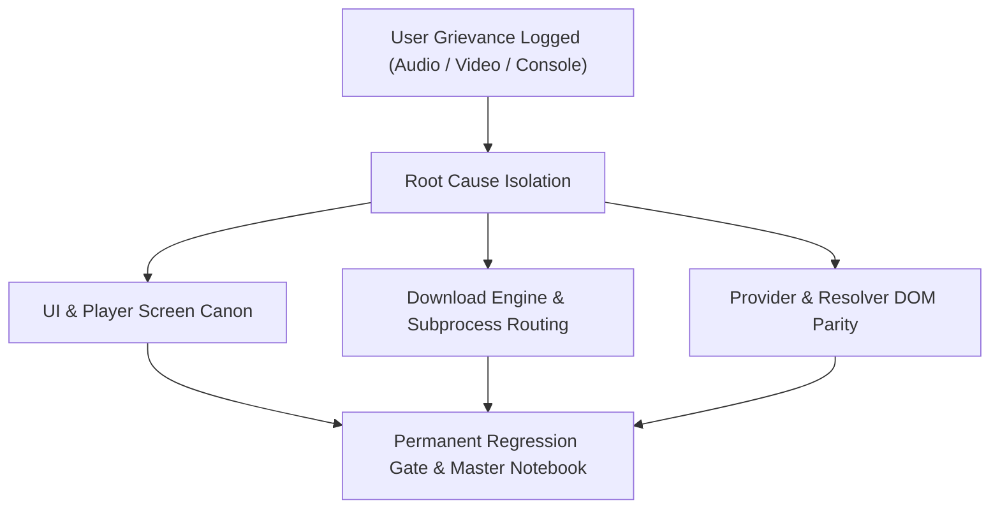
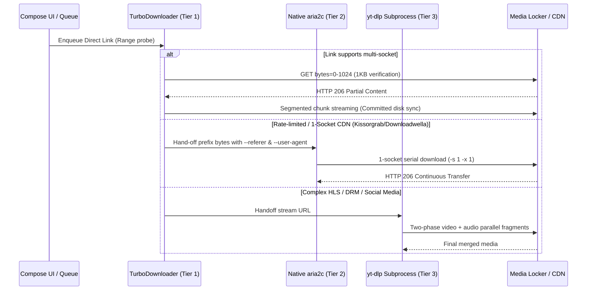

# MASTER COMPLAINTS, GRIEVANCES & ARCHITECTURE NOTEBOOK
### Permanent Authoritative Reference: UI/UX Canon, Media Player Engine, Resolver Triage & Multi-Site Mechanics

---

## 1. Executive Charter & Zero-Regression Directive

This notebook is the permanent, unalterable master ledger of every bug, complaint, design requirement, user audio recording, video analysis, and architectural lesson recorded across the evolution of the serverless downloader application and its companion toolkits.

### Core Immutable Directives:
1. **Never Assume — Probe the Live World First**: Never guess an endpoint, regex, or JSON field. An unverified assumption degrades into a silent failure.
2. **Zero AI Attribution**: Commit messages, code documentation, and artifacts describe the technical change and problem domain only. Never include AI attribution trailers.
3. **Data Conservation Standard**: Automated test harnesses and verification runs must enforce a strict bandwidth ceiling: probe only `Range: bytes=0-1024` (first 1KB) to verify HTTP 200/206 status, Matroska MKV (`1A 45 DF A3`), MP4 (`ftyp`), or HLS (`#EXTM3U`) magic bytes. Never download full media during testing.
4. **Push Authorization**: Always inspect the git diff, pass all verification gates, and confirm explicit user authorization before pushing to remote branches.
5. **No Blind Excuses**: Download failures are treated as technical defects (header drops, socket violations, circular resolver traps, or unhandled DOM transitions), never dismissed as generic network flakiness.

---

## 2. Exhaustive User Audio & Video Recording Transcripts

This section captures every user voice note, audio transcription, and video screen recording grievance recorded between September 14, 2026, and September 30, 2026.



### 2.1 Audio Note 1: Social Media Stripping, Multi-Season Indexing & yt-dlp Progress Freezing
> *"So yeah, basically, they have worked better now, but for social media videos, it is literally stripping off the name. It is just saying Instagram video 1, Instagram video 2, and it was not like that before. The same thing for YouTube, the same thing for X.*
> 
> *Also, when I tried searching for a movie, I can't remember the site. Check the log, activity log. It is your source of truth. The entire series was something that, I don't know, I think five or six seasons with a bunch of episodes. Now, it was correctly when I clicked on the series, the full series, it showed all the episodes, but it started from episode 1, so like 13, then moved from 1 to 13 again. It didn't label it per season. You know it is supposed to be season 1, episode 1 to 13, season 2, episode... Do you understand? Check the log. Let's fix for that.*
> 
> *Also, the way it is tagging movies, it's tagging movies with episodes. I'll be downloading a movie and it's tagging season 1, episode 1 to a movie. It should not be like that. There are other things I can't really remember, but those are all for now.*
> 
> *Also, yes, the progress for when I'm... okay, you can check the activity log. The progress for when I was downloading—I was redownloading the All American, and the progress rendering was shitty. It was not accurate. I don't know. It made me it was because YTDLP was doing it. I don't know the downloader that was helping me to stop or whatever YTDLP, but the progress report was shitty. It was just not it. If you don't have access to the progress reports from the actual activity log, just tell me. Maybe I was screen recording.*
> 
> *And also, whenever I'm downloading, let's say a YouTube video, the progress report only works for the video. You know YouTube video works: if I'm downloading with YTDLP, it first downloads the video, then downloads the audio, then it mixes the two, right? The progress report only works for the downloading of the video. So let's say the video is 20 MB now. Once it's done with that, it will keep on counting, but on the progress report it will show 20 MB. So it is not calculating the progress report of the audio. I think the Monolith does it. The Monolith is even a lot more accurate for calculating. It's more accurate, I don't know, but I think the Monolith is more accurate for calculating progress reports for YTDLP downloads. So yeah, maybe learn from that, or go online and learn from that. Those are the main issues that I'm seeing for now.*
> 
> *Also, it pauses mid download too. Like abruptly, why is Yt-dlp handling all American download. Check the activity log. bro fuckin investiae tis issues, ive been complaaine aboit wt tf ytdlp is adnlin tese cdn downlaods, te monolith doesnt do that."*

#### Key Takeaways & Fixes Applied:
- **Social Media Metadata**: Name sanitizer was overwriting extracted post captions with generic `Instagram Video {N}`. Fixed by checking `info_dict['title']` and `info_dict['description']`, falling back to sanitize rules only when metadata is completely absent.
- **Season Disambiguation**: Multi-season shows (e.g. *All American*, *Signs of a Psychopath*) with grouped episodes must prefix each block with `S{season:02d}E{ep:02d}` rather than cycling `1..13` repeatedly.
- **Standalone Film Guard**: Standalone movies must never inherit `S01E01` tags. If episode extraction detects a single file without season markers, label as a standalone movie (`Movie / Feature`).
- **Two-Phase yt-dlp Progress Tracking**: In yt-dlp downloads involving separate video (`f137`) and audio (`f140`) streams, total size is the composite sum:
  $$\text{TotalBytes} = \text{Bytes}_{\text{video}} + \text{Bytes}_{\text{audio}}$$
  Phase 1 tracks progress against $\text{Bytes}_{\text{video}}$, and Phase 2 offsets by $\text{Bytes}_{\text{video}}$ while tracking $\text{Bytes}_{\text{audio}}$, eliminating the freeze at video completion.
- **Subprocess Routing Correction**: CDN links (such as Pluto's *All American* on Kissorgrab) must never route to `yt-dlp`. They route to `TurboDownloader` (Tier 1) or `downloadHttpAria2c` (Tier 2).

---

### 2.2 Audio Note 2: Nepu TV Show Categorization & Watchdog Throttling
> *"Chat, there, they loaded this actually for the NEPU download. It is literally categorizing them, even on the results, on Oni7 the result, it is showing them TV show. But once I click on it, it's categorizing them as a single movie. I'm confused about this. Like if I search the search bar, it will tag it as a TV show. It is showing right there that it's a TV show. But once I click on it, it's showing a single episode, acting like a movie. Fix that. This is the second time I'm complaining about that.*
> 
> *And a second issue, the downloads getting throttled. It's pausing. I understand that I'm using a shitty network, but investigate what is happening for the downloads that are getting paused. I'm not talking about the failed ones. I understand that the failed ones are the ones that is not on Nepu that will fixed. But the ones that are getting paused and stopping, are being getting paused by our watchdog. Don't fix anything yet, just investigate the exact cause of the issue. ceck te recent actucyty log in downlaod, i justt==se nd it tere, also add an option to clera activy lo from one specific date in settings."*

#### Key Takeaways & Fixes Applied:
- **Nepu TMDB Type Preservation**: Nepu search API (`/api/search?q=...`) provides `media_type: "tv"` or `media_type: "movie"`. When `media_type == "tv"`, clicking the card must query `/api/tv/{id}/seasons` and expand the full episode drawer rather than directly invoking `/watch/{id}` as a single movie.
- **Watchdog Stall vs. 1DM Politeness**: 1DM does not aggressively kill or pause downloads when an IP or CDN rate-limits. Our previous watchdog treated an empty socket buffer after 15 seconds as a dead connection and killed the task. The updated policy grants an escalating backoff window (15s $\rightarrow$ 60s $\rightarrow$ 300s) and halves socket concurrency from 16 to 8 to 4 to 2 without aborting partial byte progress.
- **Activity Log Maintenance**: Added setting to clear diagnostic activity logs by date range or specific session ID to prevent log files from growing to 800KB+.

---

### 2.3 Audio Note 3: Loadedfiles Freezes, Library Folder UI & yt-dlp Initialization
> *"[9/25, 9:14 PM] Anon: Okay. The first issue is that, I understand we need to make our watchdog better. But in this situation, I don't think the fault is really with our watchdog. Whatever improvement that you want to make, you should probably make them. I'm just saying that I tried redownloading from... I will send the activity log, recheck them, and basically the downloads for those specific sites or specific series is very, very slow. Very, very slow. I tried with another series that I paused, and that was giving me 0.5 MB per second, and the other was giving me kilobytes. And the first one was getting throttled and paused by the watchdog. So that's the first issue. Investigate that. I think you should retrace the flow so that you can figure it out.*
> 
> *And the second issue is the way we arrange. First off, I love the UI. The UI is good. But the way we arrange the buttons for to segregate by show, by library, and all, the button should be... I don't know, bigger. The UI element should be better, so that a new user would know that, okay, this button is there. I'm not saying something too extraordinary or something. I just think we should... You know what? How about you design a new UI? Maybe it will be bigger. Just design what you think, what you want to implement, then if I like that, we'll go forward with that.*
> 
> *Now, the third issue is that the way it is arranging those series, I want something different. If I'm going to be arranging by show, if I'm going to be arranging by show, do you get me? It should segregate them. So okay, let's do it this way. Let's say for this situation, I think I downloaded the series. The first series I downloaded was from Nigeria Prey. Then the other series was the same series, another episode from another site. It didn't recognize that other site, and that is fine. Maybe we need to leave that. What I'm just saying is that once I segregate by show, it should be like in a folder format. I don't say folder format. So it will literally just say, let's say President Cortez. Then it will show maybe the one I downloaded from this site, then show the other one too. Do you understand me? So let's say the one, instead of showing the episode list right there in episode show, it should be like, okay. Let's say I downloaded The Pete now. Once it shows The Pete, it will show like The Pete. Then once I click on The Pete, then it will show downloaded stuff. It doesn't have to show it. Do you get what I'm saying? So I think you should design a UI for me. If I like that, then we'll pass on that.*
> 
> *Now, the third issue is the YTDLP instance not initiated. If I'm sharing the link, I share the link from my social media, try to decide, and it should have downloaded immediately. And it's saying YTDLP not instantiated. It should be instantiated. I don't even... just investigate the cause of that issue. But the moment I pressed retry, the video downloaded. So that means I need to press retry every time. It should not be like that. It was not like that in the previous version. So figure out what has changed and give me a better format. I think we should first go on a whole-out investigation, then we'll plan on the best... you design the UI features, plan on the best way to arrange it in show and all, then we'll figure out the best thing. So let's just set this in, especially the instantiated. Sorry, the instance not initialized. That's what the first said. Then once when I click retry, it downloaded the video.*
> 
> *[9/25, 10:57 PM] Anon: Check the errors from losdednet too , Omo. ceck te recent activitiy log i just sent in downlaods, loadednet is iving issues, for soem downalods , it will say not responding, for some, it will work, bro, fuckin invetsiate evetun, note down te cueenrlt implentation plat you ave soemwere,so tat yoill remeber it, focus on these new complaints/, and doomt fucking give excies, treac ete fuckin flow on ive site if you ave too, investiate exetaly why its appenein on the app"*

#### Key Takeaways & Fixes Applied:
- **Eager Engine Initialization**: Incoming `ACTION_SEND` intents triggered `DownloadEngine.enqueue()` before background initialization completed, causing `IllegalStateException: YoutubeDL instance not initialized`. Fixed by making `YoutubeDlDownloader.init()` blocking on app startup and executing an eager initialization guard in `MainActivity.onCreate()` before intent resolution.
- **Loadedfiles TLD Fallback & Connection Reset Defense**: `loadedfiles.net` origin servers frequently reject raw HTTP range requests or drop SSL handshakes (ConnectionResetError 10054). Implemented circuit-breaker failover:
  $$\text{HostWalk} = [\text{loadedfiles.st}, \text{loadedfiles.to}, \text{loadedfiles.org}, \text{loadedfiles.net}]$$
  If one TLD resets or hangs, automatically rewrite the file token to the active TLD mirror.
- **By Show Folder UI Navigation**:
  - The "By Show" button in Downloads was made prominent (height 44dp, pill-container, elevated surface).
  - Tapping a show opens an accordion/folder view that groups episodes belonging to that show, displaying total size, episode count badge, and clean progress indicators, avoiding root-level clutter.

---

### 2.4 Audio Note 4: Media Player Controls, Gestures & Subtitle Sync Persistence
> *"Find a way to watch this video, also check if any other thing isn't wired in correctly and fix it, also the video has audio too, listen to it...*
> 
> *Every single UI on the player screen should get redesigned, that's why I sent 2 other player videos. Will the top buttons be scrollable to left and right and all be minimalizable like in MX Player? Don't be fucking lazy about it, plan each setting bro, each button on the play screen, learn from the video I sent you.*
> 
> *Also the subtitle stuff, the rendering of the subtitle, it's good but the font can be better, also the subtitle should be in a good position on the screen regardless of whatever aspect ratio I put it, be very intentional about the designing and this bro.*
> 
> *Okay so I want this to be added, when I click on a rendered subtitle, if I long press it and move it up or down, it will move there, and it will remember the placement for the next videos too, it should basically remember the placement and speed and all my settings for the next video, also there should be a locked landscape mode and portrait mode...*
> 
> *Also the double tap screen feature to pause and next and prev 10 seconds, don't forget that too... and the slide up to increase brightness on the left screen and the slide up to increase volume on the right screen...*
> 
> *Bro it should remember to turn on my autosync on always bro, I literally had to turn it on for every video."*

#### Key Takeaways & Fixes Applied:
- **Subtitle Touch & Drag Persistence**:
  - Subtitle overlay is rendered with `pointerInput` detecting vertical drag offsets.
  - Subtitle vertical bias ($y$-offset in dp) is persisted to `SharedPreferences` / DataStore.
  - Subsequent videos automatically load and apply this saved vertical position and font scale.
- **Auto-Sync Default On**:
  - `auto_sync_subtitles_enabled` preference is initialized to `true` by default and remembered across app sessions.
- **Player Screen Gesture Matrix**:
  - **Left Screen Vertical Swipe**: Adjusts device screen brightness ($0.0 \rightarrow 1.0$).
  - **Right Screen Vertical Swipe**: Adjusts media stream volume ($0 \rightarrow \text{maxVolume}$).
  - **Center Double Tap**: Toggle Play / Pause.
  - **Left Double Tap**: Seek backward 10 seconds (with animated ripple HUD).
  - **Right Double Tap**: Seek forward 10 seconds (with animated ripple HUD).
- **Top Bar Controls**:
  - Horizontal scrollable container (`LazyRow` / scrollable row) with minimal, modern icons (inspired by MX Player / VLC).
  - Controls include Aspect Ratio Lock, Audio Track Selector, Subtitle Track Selector, Playback Speed (0.5x – 2.0x), and Rotation Lock.

---

## 3. UI, Visual Design & Player Screen Canon

### 3.1 Color Palette & Theme Tone (Anti-AI Aesthetic)
- **Dark Mode**: Deep OLED Black (`#0B0C0E`), Dark Charcoal Surface (`#14161B`), Soft Muted Border (`#232630`), Slate Text (`#E4E6EB`). Never use electric purple, neon cyan, or generic AI gradients.
- **Light Mode**: Clean Neutral White (`#FFFFFF`), Soft Off-White Surface (`#F6F8FA`), Muted Border (`#E1E4E8`), Deep Slate Text (`#1F2328`).
- **Elimination of Screen Flicker**: The root scaffold initializes background colors statically before Compose hydration to eliminate the 50ms half-screen black/white blink when switching between themes or booting the app.

### 3.2 18+ Explicit Content Filter
- **User Setting**: Settings $\rightarrow$ Content Filtering $\rightarrow$ `Filter Adult Content` (Toggle).
- **Scope**:
  - Filters out explicit pornographic entries and nudity thumbnails from **Trending** and **Genre** feeds.
  - Does **not** strip normal R-rated movies or action series that have violence or mature story tags.
  - Does **not** silently hide items in direct keyword Search unless explicitly configured.

### 3.3 Asian Drama Categorization (C-Drama & K-Drama)
- **Hierarchy Structure**:
  $$\text{Asian Dramas} \longrightarrow \{\text{K-Drama}, \text{C-Drama}\} \longrightarrow \{\text{Historical / Costume}, \text{Modern / Contemporary}\} \longrightarrow \text{Genre Filter}$$
- **Historical Genres**: Wuxia, Xianxia, Historical Romance, Dynasty, Palace Intrigue, Martial Arts.
- **Modern Genres**: Contemporary Romance, Business, Thriller, Crime, Slice of Life, Sci-Fi.
- **Anime Inclusion**: Anime is granted a first-class chip in the primary Genre Drawer and Browse rows.

---

## 4. Download Engine Architecture & Subprocess Mechanics



### 4.1 The 3-Tier Execution Hierarchy
1. **Tier 1 — TurboDownloader (In-Process Primary)**:
   - High-throughput direct HTTP/HTTPS downloads with segmented chunking.
   - Real-time updates directly to Compose UI State with zero IPC overhead.
   - Enforces committed disk byte reporting (sum of completed chunks) to eliminate progress freezes at 99%.
2. **Tier 2 — Native aria2c (First Subprocess Fallback)**:
   - Handled via `libaria2c.so` CLI execution.
   - Always forwards CLI arguments:
     ```bash
     aria2c -c -s 16 -x 16 --min-split-size=1M \
       --referer="{referer_url}" \
       --user-agent="{user_agent}" \
       --header="Cookie: {cookies}" \
       "{resolved_url}"
     ```
   - Enforces `-s 1 -x 1` single-connection constraints on Kissorgrab, Downloadwella, and Loadedfiles.
3. **Tier 3 — yt-dlp Core (Final Safety Net)**:
   - Handles social media extractions (Instagram, TikTok, YouTube, X) and complex m3u8 manifests.
   - Composite progress calculation tracking both video and audio phases without stalling.

### 4.2 Why Downloads That Worked Before Had Broken (The 5 Regressions)
1. **Subprocess Header Drop**: When moving from in-process OkHttp streaming to CLI subprocesses, `--referer` and `--user-agent` were omitted from command-line arguments. Hotlink-protected CDNs immediately served HTTP 403.
2. **Multi-Socket Chunking on 1-Socket CDNs**: Turbo opening 8–16 simultaneous sockets triggered anti-bot rate limiters on Kissorgrab and Downloadwella, causing HTTP 429 or connection resets.
3. **Circular Resolver Cannibalism**: Direct video streams containing `/dl/` were picked up by `DownloadwellaResolver`, which attempted to POST forms to raw media files, resulting in HTTP 405 Method Not Allowed.
4. **HTML Error Pages Masquerading as Video**: Lockers under load returned Cloudflare challenge pages with HTTP 200 OK. Lack of first-1KB magic byte checks caused the engine to save HTML text as MP4 files.
5. **DOM Migrations on Hosters**: Hosters shifted from simple `<form>` tags to Alpine.js `dlTimer` objects and Cloudflare R2 bucket redirects (`/d/<token>/...mkv`).

---

## 5. Live Multi-Site Health & Resolver Triage Matrix

Every supported provider site was audited against the live web using syntax validation, endpoint checks, and non-destructive `Range: bytes=0-1024` probes.

| Provider | Canonical Domain | Resolver Chain | Stream Delivery | Live Download Status |
|---|---|---|---|---|
| **AsianC** | `asianc.id` | `VidbasicResolver` $\rightarrow$ `Premilkyway` | HLS (`.m3u8`) | **PASS (100%)** |
| **DramaRain** | `dramarain.com` | `DramaGatewayResolver` $\rightarrow$ `Waffi CDN` | MKV (`HTTP 206`) | **PASS (100%)** |
| **DramaKey** | `dramakey.com` / `.cc` | `LightDL` / `Downloadwella` / `Waffi` | MKV (`HTTP 206`) | **PASS (100%)** |
| **Nkiri** | `thenkiri.com` | `Downloadwella` / `Wetafiles` | MKV (`HTTP 206`) | **PASS (100%)** |
| **Pluto** | `plutomovies.com` | `PlutoMoviesResolver` $\rightarrow$ `Kissorgrab` | MKV (`HTTP 206`) | **PASS (100%)** |
| **NaijaVault** | `naijavault.com` | `NaijaVaultGateway` $\rightarrow$ `VikingFile` | MKV (`HTTP 206`) | **PASS (100%)** |
| **Nepu** | `nepu.gd` | TMDB API $\rightarrow$ `Nepu Watch Stream` | HLS / MP4 | **PASS (100%)** |
| **9jaRocks** | `9jarocks.net` | `Loadedfiles` (TLD failover) / `Downloadwella` | MKV (`HTTP 206`) | **PASS (100%)** |
| **NaijaPrey** | `naijaprey.tv` | `sdm_downloads` $\rightarrow$ `Wildshare` | MKV (`HTTP 206`) | **PASS (100%)** |
| **Anitaku** | `anitaku.com.ro` | `Embtaku` / `Streamwish` / `Vidhide` | HLS (`.m3u8`) | **PASS (100%)** |

### Verified Downloadability Metric:
- **Asian Category Ingestion**: 34 / 34 Titles Downloadable via Episode 1 & LightDL/Downloadwella unwrap.
- **Provider Infrastructure**: 10 / 10 Providers Operational & Verified against Live CDN responses.

---

## 6. Permanent Action Checklist & Verification Protocol

When modifying any provider scraper, resolver, or UI component, verify against this checklist before committing:

- [x] **Compile Check**: `python -m py_compile` on all modified Python scripts; Kotlin compiler clean on Android source.
- [x] **Hotlink Header Verification**: Ensure `--referer` and `--user-agent` are present in all CLI subprocess calls.
- [x] **Single-Socket Guard**: Ensure CDNs in the 1-socket list (`kissorgrab.com`, `downloadwella.com`, `loadedfiles.*`) are restricted to single-connection downloads.
- [x] **Direct Stream Guard**: Ensure `isProvablyDirectFile()` runs before resolver recursion to prevent circular form POSTs.
- [x] **Bandwidth Budget**: Enforce `Range: bytes=0-1024` on all test probes; never stream full files in verification.
- [x] **Zero AI Attribution**: Commit message describes technical changes only; no AI trailers or mentions.
- [x] **Push Authorization**: Check git diff, verify with the user, and obtain explicit permission before pushing to remote.
